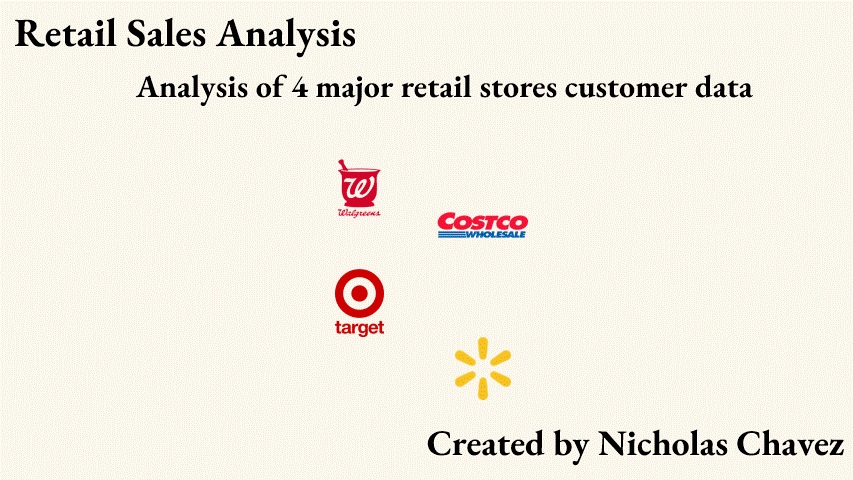

# Retail Sales Analysis 📈 
Utilizing Excel Power Query, Pivot Tables, Power BI, and Slides, I conducted a retail sales analysis using 4 different retailer datasets. All the data was combined and cleaned with Power Query, then exported to Power BI, where I created an interactive dashboard. I logged the blueprint and findings of the analysis in Google Slides/PowerPoint to view on the GIF below.
<!--

-->

### Tech & Methods ⚙️

  

* PowerBI
* Excel Power Query
* Google Slides/PowerPoint
---
### Repository Information 📄
This repository includes 9 files:

* READ.md is what you are reading now and explains information associated with the project. 
* Combined_Retail_Data.xlsx is the Excel workbook associated with the cleaning and Exploratory Data Analysis.
* Retail Sales Data.pptx is the slide dec displaying the steps and results with this project.
* RetailerDashboard.pbix is the PowerBI file containing the dashboard.
* RetailerDashboard.pdf is the pdf version of the dashboard from PowerBI.
* RetailSalesData.gif is a gif of the slides which displays at the top of this repository.
* All other files are data files.
Note: 1. Retailer... through 4. Retailer... are the original datasets before combination and cleaning.
